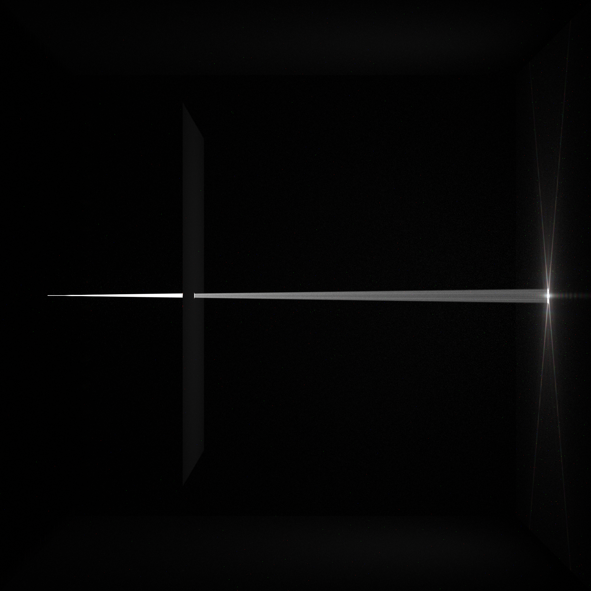
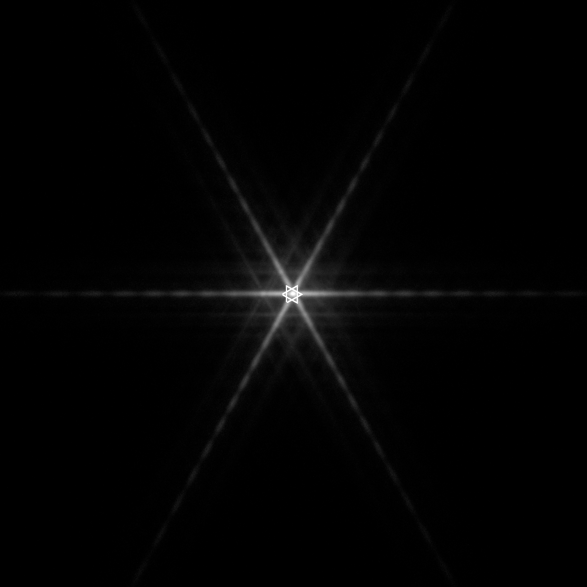

# Diffraction Simulation #

This is my exploration of wave-optical light transport. In order to simulate the diffraction phenomenon, I took [A Free Space Diffraction BSDF](https://github.com/ssteinberg/fsdBSDFpaper) as a reference and rendered some beautiful images:)

## Compilation ##

This implementation is built on the PBRT-v3 framework. Therefore, you can follow the [PBRT-v3 build instructions](https://github.com/mmp/pbrt-v3) to compile this project.

## Images ##
### The whole box scene ###


### Diffraction patterns from different apertures ###




### RGB rendering for tricolor light composed of wavelengths at 465nm, 530nm and 630nm ###


### Spectral rendering with uniform wavelength sampling ###


Building pbrt
-------------

To check out pbrt together with all dependencies, be sure to use the
`--recursive` flag when cloning the repository, i.e.
```bash
$ git clone --recursive https://github.com/mmp/pbrt-v3/
```
If you accidentally already cloned pbrt without this flag (or to update an
pbrt source tree after a new submodule has been added, run the following
command to also fetch the dependencies:
```bash
$ git submodule update --init --recursive
```

pbrt uses [cmake](http://www.cmake.org/) for its build system.  On Linux
and OS X, cmake is available via most package management systems.  To get
cmake for Windows, or to build it from source, see the [cmake downloads
page](http://www.cmake.org/download/).  Once you have cmake, the next step
depends on your operating system.

### Makefile builds (Linux, other Unixes, and Mac) ###

Create a new directory for the build, change to that directory, and run
`cmake [path to pbrt-v3]`. A Makefile will be created in the current
directory.  Next, run `make` to build pbrt, the obj2pbrt and imgtool
utilities, and an executable that runs pbrt's unit tests.  Depending on the
number of cores in your system, you will probably want to supply make with
the `-j` parameter to specify the number of compilation jobs to run in
parallel (e.g. `make -j8`).

By default, the makefiles that are created that will compile an optimized
release build of pbrt. These builds give the highest performance when
rendering, but many runtime checks are disabled in these builds and
optimized builds are generally difficult to trace in a debugger.

To build a debug version of pbrt, set the `CMAKE_BUILD_TYPE` flag to
`Debug` when you run cmake to create build files to make a debug build.  To
do so, provide cmake with the argument `-DCMAKE_BUILD_TYPE=Debug` and build
pbrt using the resulting makefiles. (You may want to keep two build
directories, one for release builds and one for debug builds, so that you
don't need to switch back and forth.)

Debug versions of the system run much more slowly than release
builds. Therefore, in order to avoid surprisingly slow renders when
debugging support isn't desired, debug versions of pbrt print a banner
message indicating that they were built for debugging at startup time.

### Xcode ###

To make an Xcode project on OS X, run `cmake -G Xcode [path to pbrt-v3]`.
A `PBRT-V3.xcodeproj` project file that can be opened in Xcode.  Note that
the default build settings have an optimization level of "None"; you'll
almost certainly want to choose "Faster" or "Fastest".

### MSVC on Windows ###

On Windows, first point the cmake GUI at the directory with pbrt's source
code.  Create a separate directory to hold the result of the build
(potentially just a directory named "build" inside the pbrt-v3 directory)
and set that for "Where to build the binaries" in the GUI.

Next, click "Configure".  Note that you will want to choose the "Win64"
generator for your MSVC installation unless you have a clear reason to need
a 32-bit build of pbrt.  Once cmake has finished the configuration step,
click "Generate"; when that's done, there will be a "PBRT-V3.sln" file in
the build directory you specified. Open that up in MSVC and you're ready to
go.

### Build Configurations ###

There are two configuration settings that must be set when configuring the
build. The first controls whether pbrt uses 32-bit or 64-bit values for
floating-point computation, and the second controls whether tristimulus RGB
values or sampled spectral values are used for rendering.  (Both of these
aren't amenable to being chosen at runtime, but must be determined at
compile time for efficiency).  The cmake configuration variables
`PBRT_FLOAT_AS_DOUBLE` and `PBRT_SAMPLED_SPECTRUM` configure them,
respectively.

If you're using a GUI version of cmake, those settings should be available
in the list of configuration variables; set them as desired before choosing
'Generate'.

With command-line cmake, their values can be specified when you cmake via
`-DPBRT_FLOAT_AS_DOUBLE=1`, for example.
